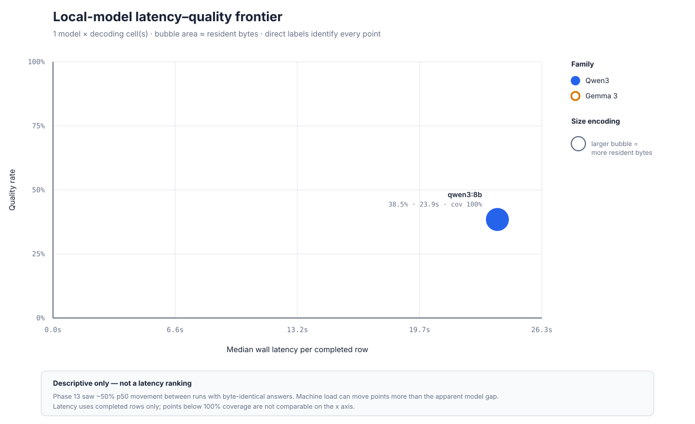

# Model matrix

Manifest-backed comparison over the explicitly selected model, variants, and golden-set population. This report does not generalize beyond those cells.

Golden set hash: `b59ee2659a17714c6cff995ef64a8da04cc7d601ca01ba1634d17e296dad551c`
Cells: **1** across **1 model(s)**
Total measured API spend: **$0.000000** (local models are unpriced, not free)

## Latency–quality frontier

This harness-generated scatter is descriptive, not a latency ranking; the Phase 13 instability caveat is embedded in the SVG.

| Model | Params | Quant | Resident | Variant | Decoding | Prompt SHA-256 | Context k | N | Judge pass | Strict match | Numeric exact match | Citation hit | Abstention accuracy | Wall p50 | Wall p95 | Gateway p50 | Gateway p95 | Tokens in / out | Cost | Manifest |
|---|---:|---|---:|---|---|---|---:|---:|---:|---:|---:|---:|---:|---:|---:|---:|---:|---:|---:|---|
| `ollama/qwen3:8b` | 8.2B | `Q4_K_M` | 5.75 GiB | `D_agentic` | t=0, p=0.95, k=20, max=768 | — | 6 | 26 | 38.5% | 42.3% | 45.8% (n=24) | 53.8% | 53.8% | 23935 ms | 48625 ms | 21357 ms | 48606 ms | 106088 / 12854 | $0.000000 | `matrix_ollama_qwen3_8b_d_agentic_t0_p0p95_861c711def89` |

## By category

Category-scoped acceptance criteria must be read from this table rather than inferred from the aggregate row. `Numeric` is scored only over rows whose reference carries a numeric quantity; its `n` differs from the category `n` for that reason, and a blank cell means no row in that category is in scope.

| Model | Variant | Decoding | Prompt SHA-256 | Context k | Category | N | Strict match | Numeric exact match | Citation hit | Abstention accuracy |
|---|---|---|---|---:|---|---:|---:|---:|---:|---:|
| `ollama/qwen3:8b` | `D_agentic` | t=0, p=0.95, k=20, max=768 | — | 6 | `aggregation` | 14 | 35.7% | 41.7% (n=12) | 50.0% | 50.0% |
| `ollama/qwen3:8b` | `D_agentic` | t=0, p=0.95, k=20, max=768 | — | 6 | `multi_hop` | 12 | 50.0% | 50.0% (n=12) | 58.3% | 58.3% |

## Model identity and size

Parameter count and quantisation come from Ollama `show`; the digest and artifact bytes come from installed tags; resident bytes come from Ollama `ps` while that candidate was loaded. Tag numbers are never treated as parameter counts.

| Model | Family | Parameters | Quantisation | Digest | Artifact | Resident | VRAM | Ollama |
|---|---|---:|---|---|---:|---:|---:|---|
| `ollama/qwen3:8b` | `qwen3` | 8.2B | `Q4_K_M` | `500a1f067a9f782620b40bee6f7b0c89e17ae61f686b92c24933e4ca4b2b8b41` | 4.87 GiB | 5.75 GiB | 5.75 GiB | `0.32.5` |

## Judge verdicts and reasons

The fixed local judge applies the versioned rubric to each candidate answer. Every verdict, including its `reason`, is stored in the RunManifest. The lists below surface every failed verdict plus up to three passing examples per cell; they are explanations to inspect, not independent ground truth.

The 20-label validation supports only an at-least-83% judge-accuracy claim, and a null classifier scores 19/20 on that set. Judge pass rate is therefore read conjunctively with deterministic metrics under ADR-0014, never alone.

### `ollama/qwen3:8b` · `D_agentic` · t=0, p=0.95, k=20, max=768

Judge: `ollama/qwen3:8b` · coverage 100.0% · passes 10/26.

- `ag_001` — **FAIL** (`INCORRECT`): The candidate answer incorrectly states the amount from Halcyon Retail Group as $9,000.00, whereas the reference answer and evidence show it is $12,000.00.
- `ag_002` — **FAIL** (`INCORRECT`): The candidate answer incorrectly sums the amounts, resulting in a wrong total.
- `ag_007` — **FAIL** (`INCORRECT`): The candidate answer incorrectly states the total invoiced amount as $55,667.64, which is not supported by the provided evidence.
- `ag_008` — **FAIL** (`FALSE_ABSTAIN`): The candidate answer abstains despite the reference answer providing the correct information.
- `ag_009` — **FAIL** (`FALSE_ABSTAIN`): The candidate answer abstains despite the reference answer providing the correct information.
- `ag_010` — **FAIL** (`FALSE_ABSTAIN`): The candidate answer is an abstention, but the reference answer provides the required information.
- `ag_011` — **FAIL** (`FALSE_ABSTAIN`): The candidate answer falsely abstains from providing the answer when the reference answer is present in the supporting evidence.
- `ag_012` — **FAIL** (`FALSE_ABSTAIN`): The candidate answer falsely abstains from providing the answer when the reference answer is available in the supporting evidence.
- `mh_002` — **FAIL** (`FALSE_ABSTAIN`): The candidate answer falsely abstains from providing an answer when the reference answer explicitly states the 1099 amount and invoice total.
- `mh_005` — **FAIL** (`FALSE_ABSTAIN`): The candidate answer falsely abstains from providing an answer when the reference answer confirms the checking balance grew.
- `mh_006` — **FAIL** (`INCORRECT`): The candidate answer incorrectly states the opening balance for January-to-June as $7,400.09, which is actually the closing balance for January.
- `mh_007` — **FAIL** (`FALSE_ABSTAIN`): The candidate answer falsely abstains when the reference answer provides a clear 'Yes'.
- `mh_008` — **FAIL** (`INCORRECT`): The candidate answer incorrectly states that the invoice did not exceed the 1099 amount, while the reference answer confirms it did.
- `mh_010` — **FAIL** (`FALSE_ABSTAIN`): The candidate answer abstains despite the reference answer providing the correct information.
- `mh_011` — **FAIL** (`FALSE_ABSTAIN`): The candidate incorrectly abstained from answering a question that the reference answer explicitly addresses.
- `mh_012` — **FAIL** (`INCORRECT`): The candidate answer incorrectly states the total amount of Priya's Halcyon invoices as $22,175.04, whereas the reference answer and supporting evidence indicate the total is $44,683.92.
- `ag_003` — **PASS** (`NONE`): The candidate answer correctly states Marcus Chen's total gross pay and agrees with the reference answer.
- `ag_004` — **PASS** (`NONE`): The candidate answer correctly states Marcus Chen's total net pay and agrees with the reference answer.
- `ag_005` — **PASS** (`NONE`): The candidate correctly abstained as the supporting evidence was not provided.

## Agent-loop controls

**Trace coverage, step budget and token budget are invariants, not results.** The loop appends exactly one step per iteration over a fixed range and charges tokens through `min(..., budget - used)`, so all three read 100% by construction — a planner that never returns a valid action still scores 100% on every one. They are regression guards: if one ever drops, the loop's bookkeeping is broken. They are **not** evidence that the agent behaved well, and must never be reported as a measured safety property.

`Exhausted` is the only column here that varies with model behaviour, and it is the one worth reading. Note that a wall-clock exhaustion caused by an unreachable generator is a transport failure, not a model failure; the two are labelled separately in the step trace (ADR-0007).

Computed from the complete `AgentStep` arrays in each answer receipt. Rates divide by all golden examples in the cell, so a failed row stays a miss; the step and token averages divide only by rows that ran.

| Model | Trace coverage | Step budget | Token budget | Exhausted | Average / max steps | Average traced tokens |
|---|---:|---:|---:|---:|---:|---:|
| `ollama/qwen3:8b` | 100.0% | 100.0% | 100.0% | 3.8% | 3.58 / 6 | 3683 |

## Reading the result

`Numeric exact match` parses every quantity out of the reference answer and requires each one to appear in the candidate as a number equal within `thresholds.numeric_epsilon`. It is the metric SPEC's numeric-exact-match acceptance criteria name, and it is deliberately *not* `strict match`: the latter compares normalized strings and scores `$1,234.50` against `1234.5` as a miss. Neither is a correctness verdict, and their biases run in opposite directions — `strict match` under-credits valid paraphrases, while numeric exact match is a presence test that cannot tell whether a figure was *used* correctly and can be satisfied by a verbose answer reciting many numbers. Read them together, and treat neither as an LLM-judge result. Rows whose reference holds no quantity, including every `unanswerable` row, are out of scope rather than scored as failures.

Every rate divides by the number of golden examples in its population, so a row that failed to produce an answer counts as a miss rather than shrinking the denominator.

Citation hit and abstention accuracy are not necessarily independent signals. On an answerable population where abstentions carry no citations and every answer that does not abstain cites an expected document, the two columns are structurally identical; inspect the row receipts before treating them as corroboration.

`Context k` is read from the manifest when recorded. For older receipts predating that field, it is recovered only when the receipt's config hash exactly matches the current config; otherwise the report shows an em dash.

`Prompt SHA-256` hashes the invariant reliable-generation system instruction, not the question-specific assembled prompt. Historical manifests written before this field show an em dash rather than being assigned an identity they never recorded.

`Strict match` is a deterministic literal-anchor scorer, not a lower bound: answerable rows must repeat the reference's amounts, dates, and identifiers; other rows require a normalized reference substring. It under-credits valid paraphrases, but can also over-credit a hedged answer that lists the right anchor among several wrong candidates. Per-example reasons and complete answers live beside each manifest in its `_answers.json` receipt.

Wall latency covers the complete row, including retrieval, reranking, generation, repairs, and guardrails. Gateway latency covers completion calls only. Token counts come from provider usage when available and do not include retrieval-side embedding or keyword-extraction calls. Every displayed value is loaded from the RunManifests above, except the explicitly described config-hash recovery for historical context k; this file is generated, never hand-edited.

Phase 18 candidate models are pre-warmed with `keep_alive=10m` before their cell. Warm-up time is outside row latency, preventing a one-time model load from becoming a quality timeout; judge-load time is likewise excluded from candidate latency.

Every structured completion is capped at the manifest's `max` token count (768 in the preregistered run), and a 600-second request overrun remains an explicit `TOOL_ERR`. The cap and timeout are fixed controls, not swept settings.

Unlike the rates above, median and p95 latency are computed over completed rows only: a row that failed to produce an answer is excluded from those statistics entirely rather than counted as slow. Latency denominators can therefore differ between arms in the same table, and an arm that timed out reports a tail that understates its observed worst case. Read the latency columns against each arm's coverage, and at small N treat p95 as the slowest completed row rather than a distribution.

Phase 13 observed roughly 50% p50 movement between runs that produced byte-identical answers. This harness therefore cannot rank models by latency. The latency-quality frontier is a descriptive picture, not a model ordering or a tie-breaker.
