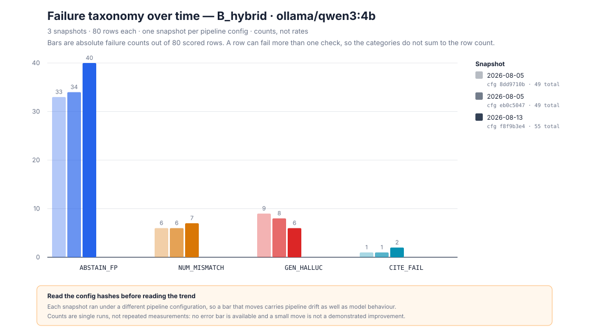
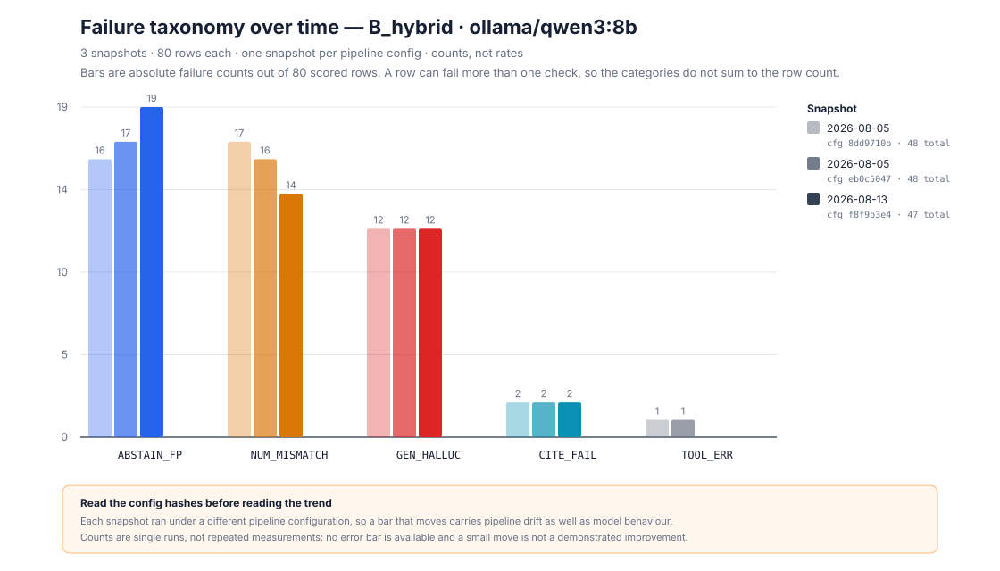

# Failure-taxonomy Pareto sequence

Generated by `python -m vaultledger.evals failure-pareto`. **Never hand-edited.** No cell is run here and no model is called: every count is the length of a `failures` array in a committed run manifest.

Repo `32743fdac3c5` · config `f8f9b3e473cf` · generated 2026-08-14T23:32:18.895152+00:00

## The comparability rule

SPEC asks for failure categories shrinking across the build. That picture is easy to manufacture by choosing snapshots, so the snapshots here are **discovered by rule** and the trend is **computed** rather than described.

Two snapshots may share a sequence only when all four match: variant, model, golden-set hash, and row population. Both must also have run the shipped prompt and the shipped decoding profile (`t=0`, `p=0.95`); receipts written before decoding was recorded qualify because `receipts/phase18_decoding_defaults.json` establishes that the implicit values were the ones later promoted to config.

Within a sequence the pipeline **configuration is allowed to differ** — that is what makes it a history instead of an A/B — and exactly one snapshot is kept per config hash, the earliest. Re-runs at one config are repetitions, not history, and letting them in would pad a flat sequence into a full-looking chart.

A sequence needs at least **3** snapshots to be drawn.

## Sequence 1: `B_hybrid` · `ollama/qwen3:4b` · 80 rows

| Snapshot | Date | Config hash | Rows | `ABSTAIN_FP` | `NUM_MISMATCH` | `GEN_HALLUC` | `CITE_FAIL` | Total |
|---|---|---|---:|---:|---:|---:|---:|---:|
| `phase11_ollama_qwen3_4b_b_hybrid_2adbab6cec95` | 2026-08-05 | `8dd9710b9ab1` | 80 | 33 | 6 | 9 | 1 | **49** |
| `phase11_ollama_qwen3_4b_b_hybrid_35d35e2fb62f` | 2026-08-05 | `eb0c50473ac0` | 80 | 34 | 6 | 8 | 1 | **49** |
| `phase18_ollama_qwen3_4b_b_hybrid_t0_p0p95_cc0a66413693` | 2026-08-13 | `f8f9b3e473cf` | 80 | 40 | 7 | 6 | 2 | **55** |

Total scored failures across the sequence: **49 → 49 → 55**.
The total moved by **+6** across the whole sequence, so **the requested shrinking-bars story is not supported for this arm**. What changed is the composition, not the height.
Categories that fell end to end: `GEN_HALLUC`. Categories that rose: `ABSTAIN_FP`, `CITE_FAIL`, `NUM_MISMATCH`.
The largest single failure category stayed `ABSTAIN_FP` throughout.

A row can trip more than one check, so the categories do not sum to the row count and the total is a count of findings rather than of failed rows. Each snapshot is a single run with no repeat measurement, so a move of one or two counts is inside the noise this build cannot resolve.

## Sequence 2: `B_hybrid` · `ollama/qwen3:8b` · 80 rows

| Snapshot | Date | Config hash | Rows | `ABSTAIN_FP` | `NUM_MISMATCH` | `GEN_HALLUC` | `CITE_FAIL` | `TOOL_ERR` | Total |
|---|---|---|---:|---:|---:|---:|---:|---:|---:|
| `phase11_ollama_qwen3_8b_b_hybrid_49b2db3bd79c` | 2026-08-05 | `8dd9710b9ab1` | 80 | 16 | 17 | 12 | 2 | 1 | **48** |
| `phase11_ollama_qwen3_8b_b_hybrid_eea876388398` | 2026-08-05 | `eb0c50473ac0` | 80 | 17 | 16 | 12 | 2 | 1 | **48** |
| `phase18_ollama_qwen3_8b_b_hybrid_t0_p0p95_c64ee5ca952f` | 2026-08-13 | `f8f9b3e473cf` | 80 | 19 | 14 | 12 | 2 | 0 | **47** |

Total scored failures across the sequence: **48 → 48 → 47**.
The last snapshot carries fewer failures than the first, but not at every step, so this is a net decrease and not a shrinking-bars sequence.
Categories that fell end to end: `NUM_MISMATCH`, `TOOL_ERR`. Categories that rose: `ABSTAIN_FP`.
The largest single failure category moved from `NUM_MISMATCH` to `ABSTAIN_FP`.

A row can trip more than one check, so the categories do not sum to the row count and the total is a count of findings rather than of failed rows. Each snapshot is a single run with no repeat measurement, so a move of one or two counts is inside the noise this build cannot resolve.

## Coverage: every comparable arm in the repository

An arm that did not reach the snapshot minimum is listed here rather than omitted. A short sequence usually means the arm was measured once, for one preregistered question, and then never re-run.

`Committed runs` counts every qualifying receipt in the arm; `snapshots` is what survives the one-per-config rule. Where the two differ, the extra runs are repetitions at an unchanged pipeline config, or arms that differ only by a knob the config hash does not cover — the two Variant-C context budgets are the case in this repository.

| Arm | Golden set | Committed runs | Snapshots | Drawn |
|---|---|---:|---:|---|
| `B_hybrid` · `ollama/qwen3:4b` · 80 rows | `b59ee265` | 4 | 3 | yes |
| `B_hybrid` · `ollama/qwen3:8b` · 80 rows | `b59ee265` | 4 | 3 | yes |
| `B_hybrid` · `ollama/gemma3:12b` · 80 rows | `b59ee265` | 1 | 1 | no |
| `B_hybrid` · `ollama/gemma3:1b` · 80 rows | `b59ee265` | 1 | 1 | no |
| `B_hybrid` · `ollama/gemma3:4b` · 80 rows | `b59ee265` | 1 | 1 | no |
| `B_hybrid` · `ollama/qwen3:14b` · 80 rows | `b59ee265` | 1 | 1 | no |
| `B_hybrid` · `ollama/qwen3:4b` · 12 rows | `ece0ea37` | 1 | 1 | no |
| `B_hybrid` · `ollama/qwen3:8b` · 12 rows | `ece0ea37` | 1 | 1 | no |
| `B_hybrid` · `ollama/qwen3:8b` · 6 rows | `b59ee265` | 1 | 1 | no |
| `C_graph` · `ollama/qwen3:8b` · 6 rows | `b59ee265` | 2 | 1 | no |
| `D_agentic` · `ollama/qwen3:4b` · 26 rows | `b59ee265` | 1 | 1 | no |
| `D_agentic` · `ollama/qwen3:8b` · 26 rows | `b59ee265` | 1 | 1 | no |

## Runs excluded from every sequence

| Run id | Reason |
|---|---|
| `phase18_ollama_qwen3_8b_b_hybrid_t0_p0p95_d5c5f885d0c9` | ran a prompt the product does not ship (ADR-0019 rejected candidate) |
| `phase18_ollama_qwen3_8b_b_hybrid_t0p3_p0p8_24454b463767` | decoding sweep arm at t=0.3/p=0.8, not the shipped profile |
| `phase18_ollama_qwen3_8b_b_hybrid_t0p3_p0p9_56aad3c596df` | decoding sweep arm at t=0.3/p=0.9, not the shipped profile |
| `phase18_ollama_qwen3_8b_b_hybrid_t0p3_p1_85c45c9d353a` | decoding sweep arm at t=0.3/p=1, not the shipped profile |
| `phase18_ollama_qwen3_8b_b_hybrid_t0p7_p0p8_797abc772f32` | decoding sweep arm at t=0.7/p=0.8, not the shipped profile |
| `phase18_ollama_qwen3_8b_b_hybrid_t0p7_p0p9_d0a54bb65ed1` | decoding sweep arm at t=0.7/p=0.9, not the shipped profile |
| `phase18_ollama_qwen3_8b_b_hybrid_t0p7_p1_b4d8ec65454b` | decoding sweep arm at t=0.7/p=1, not the shipped profile |

## Taxonomy

| Code | What it records |
|---|---|
| `ABSTAIN_FP` | abstained on a row the golden set marks answerable |
| `ABSTAIN_FN` | answered a row the golden set marks unanswerable |
| `NUM_MISMATCH` | a reference quantity is missing from the answer or differs beyond epsilon |
| `GEN_HALLUC` | the answer failed the deterministic literal-anchor check |
| `CITE_FAIL` | no citation survived verification against the retrieved chunks |
| `RANK_MISS` | an expected document was absent from the retrieved top-k |
| `TOOL_ERR` | the row produced no answer: transport, budget or loop failure |

`RANK_MISS` is raised by the retrieval evals and never appears beside the generation codes: those receipts score a different population (the rows carrying expected documents) and are reported in `reports/variant_matrix.md` instead.
