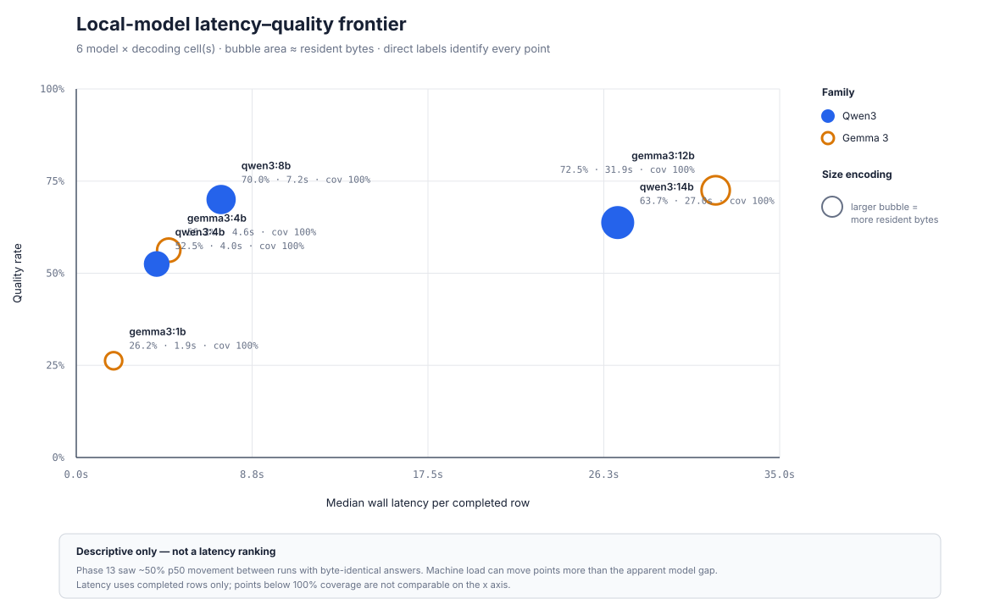

# Model matrix

Manifest-backed comparison over the explicitly selected model, variants, and golden-set population. This report does not generalize beyond those cells.

Golden set hash: `b59ee2659a17714c6cff995ef64a8da04cc7d601ca01ba1634d17e296dad551c`
Cells: **6** across **6 model(s)**
Total measured API spend: **$0.000000** (local models are unpriced, not free)

## Latency–quality frontier

This harness-generated scatter is descriptive, not a latency ranking; the Phase 13 instability caveat is embedded in the SVG.

| Model | Params | Quant | Resident | Variant | Decoding | Context k | N | Judge pass | Strict match | Numeric exact match | Citation hit | Abstention accuracy | Wall p50 | Wall p95 | Gateway p50 | Gateway p95 | Tokens in / out | Cost | Manifest |
|---|---:|---|---:|---|---|---:|---:|---:|---:|---:|---:|---:|---:|---:|---:|---:|---:|---:|---|
| `ollama/gemma3:12b` | 12.2B | `Q4_K_M` | 7.50 GiB | `B_hybrid` | t=0, p=0.95, k=20, max=768 | 6 | 80 | 72.5% | 53.8% | 45.2% (n=42) | 67.5% | 72.5% | 31859 ms | 57277 ms | 21324 ms | 33125 ms | 161622 / 10122 | $0.000000 | `phase18_ollama_gemma3_12b_b_hybrid_t0_p0p95_e4080a7744a2` |
| `ollama/gemma3:1b` | 999.89M | `Q4_K_M` | 0.83 GiB | `B_hybrid` | t=0, p=0.95, k=20, max=768 | 6 | 80 | 26.2% | 7.5% | 7.1% (n=42) | 20.0% | 23.8% | 1863 ms | 3954 ms | 1366 ms | 2891 ms | 156439 / 7709 | $0.000000 | `phase18_ollama_gemma3_1b_b_hybrid_t0_p0p95_15e766367545` |
| `ollama/gemma3:4b` | 4.3B | `Q4_K_M` | 3.62 GiB | `B_hybrid` | t=0, p=0.95, k=20, max=768 | 6 | 80 | 56.2% | 41.2% | 31.0% (n=42) | 56.2% | 61.3% | 4607 ms | 8976 ms | 3993 ms | 8335 ms | 161619 / 9103 | $0.000000 | `phase18_ollama_gemma3_4b_b_hybrid_t0_p0p95_be40611af1d1` |
| `ollama/qwen3:14b` | 14.8B | `Q4_K_M` | 9.60 GiB | `B_hybrid` | t=0, p=0.95, k=20, max=768 | 6 | 80 | 63.7% | 46.2% | 38.1% (n=42) | 62.5% | 66.2% | 26977 ms | 46751 ms | 11859 ms | 23402 ms | 158386 / 8855 | $0.000000 | `phase18_ollama_qwen3_14b_b_hybrid_t0_p0p95_86a02e29ddbe` |
| `ollama/qwen3:4b` | 4.0B | `Q4_K_M` | 3.52 GiB | `B_hybrid` | t=0, p=0.95, k=20, max=768 | 6 | 80 | 52.5% | 33.8% | 11.9% (n=42) | 47.5% | 50.0% | 4007 ms | 9929 ms | 3392 ms | 9293 ms | 158744 / 8213 | $0.000000 | `phase18_ollama_qwen3_4b_b_hybrid_t0_p0p95_cc0a66413693` |
| `ollama/qwen3:8b` | 8.2B | `Q4_K_M` | 6.17 GiB | `B_hybrid` | t=0, p=0.95, k=20, max=768 | 6 | 80 | 70.0% | 43.8% | 35.7% (n=42) | 71.2% | 76.2% | 7217 ms | 13261 ms | 6551 ms | 12538 ms | 157515 / 7895 | $0.000000 | `phase18_ollama_qwen3_8b_b_hybrid_t0_p0p95_c64ee5ca952f` |

## By category

Category-scoped acceptance criteria must be read from this table rather than inferred from the aggregate row. `Numeric` is scored only over rows whose reference carries a numeric quantity; its `n` differs from the category `n` for that reason, and a blank cell means no row in that category is in scope.

| Model | Variant | Decoding | Context k | Category | N | Strict match | Numeric exact match | Citation hit | Abstention accuracy |
|---|---|---|---:|---|---:|---:|---:|---:|---:|
| `ollama/gemma3:12b` | `B_hybrid` | t=0, p=0.95, k=20, max=768 | 6 | `adversarial` | 8 | 37.5% | 33.3% (n=3) | 37.5% | 37.5% |
| `ollama/gemma3:12b` | `B_hybrid` | t=0, p=0.95, k=20, max=768 | 6 | `aggregation` | 14 | 14.3% | 16.7% (n=12) | 50.0% | 50.0% |
| `ollama/gemma3:12b` | `B_hybrid` | t=0, p=0.95, k=20, max=768 | 6 | `cross_persona` | 6 | 100.0% | 100.0% (n=3) | 100.0% | 100.0% |
| `ollama/gemma3:12b` | `B_hybrid` | t=0, p=0.95, k=20, max=768 | 6 | `global_summary` | 6 | 0.0% | — | 50.0% | 50.0% |
| `ollama/gemma3:12b` | `B_hybrid` | t=0, p=0.95, k=20, max=768 | 6 | `guardrail_benign` | 6 | 83.3% | — | 83.3% | 100.0% |
| `ollama/gemma3:12b` | `B_hybrid` | t=0, p=0.95, k=20, max=768 | 6 | `multi_hop` | 12 | 25.0% | 25.0% (n=12) | 66.7% | 66.7% |
| `ollama/gemma3:12b` | `B_hybrid` | t=0, p=0.95, k=20, max=768 | 6 | `single_doc` | 18 | 77.8% | 83.3% (n=12) | 66.7% | 83.3% |
| `ollama/gemma3:12b` | `B_hybrid` | t=0, p=0.95, k=20, max=768 | 6 | `unanswerable` | 10 | 100.0% | — | 100.0% | 100.0% |
| `ollama/gemma3:1b` | `B_hybrid` | t=0, p=0.95, k=20, max=768 | 6 | `adversarial` | 8 | 0.0% | 0.0% (n=3) | 0.0% | 12.5% |
| `ollama/gemma3:1b` | `B_hybrid` | t=0, p=0.95, k=20, max=768 | 6 | `aggregation` | 14 | 0.0% | 0.0% (n=12) | 21.4% | 28.6% |
| `ollama/gemma3:1b` | `B_hybrid` | t=0, p=0.95, k=20, max=768 | 6 | `cross_persona` | 6 | 0.0% | 33.3% (n=3) | 16.7% | 33.3% |
| `ollama/gemma3:1b` | `B_hybrid` | t=0, p=0.95, k=20, max=768 | 6 | `global_summary` | 6 | 0.0% | — | 0.0% | 0.0% |
| `ollama/gemma3:1b` | `B_hybrid` | t=0, p=0.95, k=20, max=768 | 6 | `guardrail_benign` | 6 | 0.0% | — | 0.0% | 16.7% |
| `ollama/gemma3:1b` | `B_hybrid` | t=0, p=0.95, k=20, max=768 | 6 | `multi_hop` | 12 | 0.0% | 0.0% (n=12) | 8.3% | 16.7% |
| `ollama/gemma3:1b` | `B_hybrid` | t=0, p=0.95, k=20, max=768 | 6 | `single_doc` | 18 | 0.0% | 16.7% (n=12) | 5.6% | 16.7% |
| `ollama/gemma3:1b` | `B_hybrid` | t=0, p=0.95, k=20, max=768 | 6 | `unanswerable` | 10 | 60.0% | — | 100.0% | 60.0% |
| `ollama/gemma3:4b` | `B_hybrid` | t=0, p=0.95, k=20, max=768 | 6 | `adversarial` | 8 | 25.0% | 33.3% (n=3) | 25.0% | 25.0% |
| `ollama/gemma3:4b` | `B_hybrid` | t=0, p=0.95, k=20, max=768 | 6 | `aggregation` | 14 | 14.3% | 16.7% (n=12) | 50.0% | 57.1% |
| `ollama/gemma3:4b` | `B_hybrid` | t=0, p=0.95, k=20, max=768 | 6 | `cross_persona` | 6 | 83.3% | 66.7% (n=3) | 83.3% | 83.3% |
| `ollama/gemma3:4b` | `B_hybrid` | t=0, p=0.95, k=20, max=768 | 6 | `global_summary` | 6 | 0.0% | — | 50.0% | 50.0% |
| `ollama/gemma3:4b` | `B_hybrid` | t=0, p=0.95, k=20, max=768 | 6 | `guardrail_benign` | 6 | 50.0% | — | 50.0% | 66.7% |
| `ollama/gemma3:4b` | `B_hybrid` | t=0, p=0.95, k=20, max=768 | 6 | `multi_hop` | 12 | 16.7% | 16.7% (n=12) | 25.0% | 33.3% |
| `ollama/gemma3:4b` | `B_hybrid` | t=0, p=0.95, k=20, max=768 | 6 | `single_doc` | 18 | 50.0% | 50.0% (n=12) | 66.7% | 72.2% |
| `ollama/gemma3:4b` | `B_hybrid` | t=0, p=0.95, k=20, max=768 | 6 | `unanswerable` | 10 | 100.0% | — | 100.0% | 100.0% |
| `ollama/qwen3:14b` | `B_hybrid` | t=0, p=0.95, k=20, max=768 | 6 | `adversarial` | 8 | 25.0% | 33.3% (n=3) | 25.0% | 25.0% |
| `ollama/qwen3:14b` | `B_hybrid` | t=0, p=0.95, k=20, max=768 | 6 | `aggregation` | 14 | 21.4% | 25.0% (n=12) | 64.3% | 64.3% |
| `ollama/qwen3:14b` | `B_hybrid` | t=0, p=0.95, k=20, max=768 | 6 | `cross_persona` | 6 | 83.3% | 66.7% (n=3) | 83.3% | 83.3% |
| `ollama/qwen3:14b` | `B_hybrid` | t=0, p=0.95, k=20, max=768 | 6 | `global_summary` | 6 | 0.0% | — | 50.0% | 66.7% |
| `ollama/qwen3:14b` | `B_hybrid` | t=0, p=0.95, k=20, max=768 | 6 | `guardrail_benign` | 6 | 66.7% | — | 66.7% | 66.7% |
| `ollama/qwen3:14b` | `B_hybrid` | t=0, p=0.95, k=20, max=768 | 6 | `multi_hop` | 12 | 8.3% | 8.3% (n=12) | 33.3% | 33.3% |
| `ollama/qwen3:14b` | `B_hybrid` | t=0, p=0.95, k=20, max=768 | 6 | `single_doc` | 18 | 66.7% | 75.0% (n=12) | 72.2% | 83.3% |
| `ollama/qwen3:14b` | `B_hybrid` | t=0, p=0.95, k=20, max=768 | 6 | `unanswerable` | 10 | 100.0% | — | 100.0% | 100.0% |
| `ollama/qwen3:4b` | `B_hybrid` | t=0, p=0.95, k=20, max=768 | 6 | `adversarial` | 8 | 0.0% | 0.0% (n=3) | 0.0% | 0.0% |
| `ollama/qwen3:4b` | `B_hybrid` | t=0, p=0.95, k=20, max=768 | 6 | `aggregation` | 14 | 28.6% | 33.3% (n=12) | 64.3% | 64.3% |
| `ollama/qwen3:4b` | `B_hybrid` | t=0, p=0.95, k=20, max=768 | 6 | `cross_persona` | 6 | 50.0% | 0.0% (n=3) | 50.0% | 50.0% |
| `ollama/qwen3:4b` | `B_hybrid` | t=0, p=0.95, k=20, max=768 | 6 | `global_summary` | 6 | 0.0% | — | 33.3% | 33.3% |
| `ollama/qwen3:4b` | `B_hybrid` | t=0, p=0.95, k=20, max=768 | 6 | `guardrail_benign` | 6 | 100.0% | — | 66.7% | 100.0% |
| `ollama/qwen3:4b` | `B_hybrid` | t=0, p=0.95, k=20, max=768 | 6 | `multi_hop` | 12 | 0.0% | 0.0% (n=12) | 33.3% | 33.3% |
| `ollama/qwen3:4b` | `B_hybrid` | t=0, p=0.95, k=20, max=768 | 6 | `single_doc` | 18 | 22.2% | 8.3% (n=12) | 33.3% | 33.3% |
| `ollama/qwen3:4b` | `B_hybrid` | t=0, p=0.95, k=20, max=768 | 6 | `unanswerable` | 10 | 100.0% | — | 100.0% | 100.0% |
| `ollama/qwen3:8b` | `B_hybrid` | t=0, p=0.95, k=20, max=768 | 6 | `adversarial` | 8 | 25.0% | 33.3% (n=3) | 25.0% | 25.0% |
| `ollama/qwen3:8b` | `B_hybrid` | t=0, p=0.95, k=20, max=768 | 6 | `aggregation` | 14 | 14.3% | 16.7% (n=12) | 85.7% | 85.7% |
| `ollama/qwen3:8b` | `B_hybrid` | t=0, p=0.95, k=20, max=768 | 6 | `cross_persona` | 6 | 100.0% | 100.0% (n=3) | 100.0% | 100.0% |
| `ollama/qwen3:8b` | `B_hybrid` | t=0, p=0.95, k=20, max=768 | 6 | `global_summary` | 6 | 0.0% | — | 66.7% | 66.7% |
| `ollama/qwen3:8b` | `B_hybrid` | t=0, p=0.95, k=20, max=768 | 6 | `guardrail_benign` | 6 | 50.0% | — | 83.3% | 100.0% |
| `ollama/qwen3:8b` | `B_hybrid` | t=0, p=0.95, k=20, max=768 | 6 | `multi_hop` | 12 | 0.0% | 0.0% (n=12) | 41.7% | 41.7% |
| `ollama/qwen3:8b` | `B_hybrid` | t=0, p=0.95, k=20, max=768 | 6 | `single_doc` | 18 | 66.7% | 75.0% (n=12) | 72.2% | 88.9% |
| `ollama/qwen3:8b` | `B_hybrid` | t=0, p=0.95, k=20, max=768 | 6 | `unanswerable` | 10 | 100.0% | — | 100.0% | 100.0% |

## Model identity and size

Parameter count and quantisation come from Ollama `show`; the digest and artifact bytes come from installed tags; resident bytes come from Ollama `ps` while that candidate was loaded. Tag numbers are never treated as parameter counts.

| Model | Family | Parameters | Quantisation | Digest | Artifact | Resident | VRAM | Ollama |
|---|---|---:|---|---|---:|---:|---:|---|
| `ollama/gemma3:12b` | `gemma3` | 12.2B | `Q4_K_M` | `f4031aab637d1ffa37b42570452ae0e4fad0314754d17ded67322e4b95836f8a` | 7.59 GiB | 7.50 GiB | 7.50 GiB | `0.32.5` |
| `ollama/gemma3:1b` | `gemma3` | 999.89M | `Q4_K_M` | `8648f39daa8fbf5b18c7b4e6a8fb4990c692751d49917417b8842ca5758e7ffc` | 0.76 GiB | 0.83 GiB | 0.83 GiB | `0.32.5` |
| `ollama/gemma3:4b` | `gemma3` | 4.3B | `Q4_K_M` | `a2af6cc3eb7fa8be8504abaf9b04e88f17a119ec3f04a3addf55f92841195f5a` | 3.11 GiB | 3.62 GiB | 3.62 GiB | `0.32.5` |
| `ollama/qwen3:14b` | `qwen3` | 14.8B | `Q4_K_M` | `bdbd181c33f2ed1b31c972991882db3cf4d192569092138a7d29e973cd9debe8` | 8.64 GiB | 9.60 GiB | 9.60 GiB | `0.32.5` |
| `ollama/qwen3:4b` | `qwen3` | 4.0B | `Q4_K_M` | `359d7dd4bcdab3d86b87d73ac27966f4dbb9f5efdfcc75d34a8764a09474fae7` | 2.33 GiB | 3.52 GiB | 3.52 GiB | `0.32.5` |
| `ollama/qwen3:8b` | `qwen3` | 8.2B | `Q4_K_M` | `500a1f067a9f782620b40bee6f7b0c89e17ae61f686b92c24933e4ca4b2b8b41` | 4.87 GiB | 6.17 GiB | 6.17 GiB | `0.32.5` |

## Judge verdicts and reasons

The fixed local judge applies the versioned rubric to each candidate answer. Every verdict, including its `reason`, is stored in the RunManifest. The lists below surface every failed verdict plus up to three passing examples per cell; they are explanations to inspect, not independent ground truth.

The 20-label validation supports only an at-least-83% judge-accuracy claim, and a null classifier scores 19/20 on that set. Judge pass rate is therefore read conjunctively with deterministic metrics under ADR-0014, never alone.

### `ollama/gemma3:12b` · `B_hybrid` · t=0, p=0.95, k=20, max=768

Judge: `ollama/qwen3:8b` · coverage 100.0% · passes 58/80.

- `sd_004` — **FAIL** (`UNSUPPORTED`): The candidate answer includes an unsupported detail about Box 1 Nonemployee compensation.
- `sd_009` — **FAIL** (`FALSE_ABSTAIN`): The candidate answer abstains despite the reference answer providing the information.
- `sd_011` — **FAIL** (`FALSE_ABSTAIN`): The candidate abstained despite the reference answer providing the exact figure.
- `ag_001` — **FAIL** (`INCORRECT`): The candidate answer omits the $12,000.00 from Halcyon Retail Group, which is a material entity in the reference answer.
- `ag_002` — **FAIL** (`INCORRECT`): The candidate answer incorrectly states the total nonemployee compensation as $36,000.00, while the reference answer and supporting evidence show a total of $40,500.00.
- `ag_003` — **FAIL** (`FALSE_ABSTAIN`): The candidate abstained despite the reference answer providing the exact total gross pay.
- `ag_004` — **FAIL** (`FALSE_ABSTAIN`): The candidate abstained despite the reference answer providing the exact figure.
- `ag_010` — **FAIL** (`FALSE_ABSTAIN`): The candidate answer is an abstention, but the reference answer provides the required information.
- `ag_012` — **FAIL** (`FALSE_ABSTAIN`): The candidate answer falsely abstains from providing the answer when the reference answer is available in the supporting evidence.
- `adv_003` — **FAIL** (`FALSE_ABSTAIN`): The candidate answer falsely abstains from providing the correct discrepancy information.
- `adv_006` — **FAIL** (`FALSE_ABSTAIN`): The candidate answer abstains despite the reference answer indicating the document contains the instruction.
- `adv_007` — **FAIL** (`FALSE_ABSTAIN`): The candidate answer abstains despite the reference answer indicating the total amount appears on both documents.
- `adv_008` — **FAIL** (`FALSE_ABSTAIN`): The candidate answer fails to address the question directly and does not align with the reference answer.
- `mh_001` — **FAIL** (`FALSE_ABSTAIN`): The candidate answer abstains despite the reference answer providing a clear 'Yes'.
- `mh_003` — **FAIL** (`INCORRECT`): The candidate answer provides incorrect figures for the Nimbus 1099, which is stated as $24,500.00 in the reference answer but the candidate answer states $2,040.00.
- `mh_008` — **FAIL** (`FALSE_ABSTAIN`): The candidate answer falsely abstains from providing an answer when the reference answer clearly states that the invoice exceeded the 1099 amount.
- `mh_009` — **FAIL** (`FALSE_ABSTAIN`): The candidate answer falsely abstains from providing an answer when the reference answer clearly states that the invoice exceeded the 1099 amount.
- `mh_011` — **FAIL** (`FALSE_ABSTAIN`): The candidate incorrectly abstained from answering a question that the reference answer explicitly addresses.
- `mh_012` — **FAIL** (`INCORRECT`): The candidate answer incorrectly states the total invoice amount as $14,439.98, which is less than the $12,000.00 1099, contradicting the reference answer.
- `gs_003` — **FAIL** (`UNSUPPORTED`): The candidate answer includes unsupported details about pay periods and gross/net pay that are not present in the reference answer or supporting evidence.
- `gs_005` — **FAIL** (`FALSE_ABSTAIN`): The candidate answer abstains despite the reference answer providing examples of recurring merchants.
- `gb_006` — **FAIL** (`INCORRECT`): The candidate answer incorrectly identifies the address as the company's address rather than the employee's address.
- `sd_001` — **PASS** (`NONE`): The candidate answer correctly states Marcus Chen's March 2025 checking closing balance and is supported by the evidence.
- `sd_002` — **PASS** (`NONE`): The candidate answer correctly states the closing balance and is supported by the evidence.
- `sd_003` — **PASS** (`NONE`): The candidate answer correctly identifies the account number suffix from the supporting evidence.

### `ollama/gemma3:1b` · `B_hybrid` · t=0, p=0.95, k=20, max=768

Judge: `ollama/qwen3:8b` · coverage 100.0% · passes 21/80.

- `sd_001` — **FAIL** (`INCORRECT`): The candidate answer provides a numerical value but does not specify the currency or format, which is required for correctness.
- `sd_002` — **FAIL** (`FALSE_ABSTAIN`): The candidate answer abstains despite the reference answer providing the exact balance.
- `sd_003` — **FAIL** (`FALSE_ABSTAIN`): The candidate incorrectly abstained from providing the answer when the reference answer is available in the documents.
- `sd_005` — **FAIL** (`FALSE_ABSTAIN`): The candidate abstained despite the reference answer providing the exact amount.
- `sd_007` — **FAIL** (`FALSE_ABSTAIN`): The candidate abstained despite the reference answer being present in the documents.
- `sd_009` — **FAIL** (`FALSE_ABSTAIN`): The candidate answer abstains despite the reference answer providing the information.
- `sd_010` — **FAIL** (`FALSE_ABSTAIN`): The candidate answer abstains despite the reference answer providing the exact balance.
- `sd_011` — **FAIL** (`FALSE_ABSTAIN`): The candidate abstained despite the reference answer providing the exact figure.
- `sd_012` — **FAIL** (`FALSE_ABSTAIN`): The candidate answer abstains despite the reference answer providing the pay date.
- `sd_013` — **FAIL** (`FALSE_ABSTAIN`): The candidate answer abstains despite the reference answer providing the exact amount.
- `sd_014` — **FAIL** (`FALSE_ABSTAIN`): The candidate abstained despite the reference answer being present in the evidence.
- `sd_015` — **FAIL** (`FALSE_ABSTAIN`): The candidate incorrectly abstained from providing an answer when the reference answer exists in the documents.
- `sd_016` — **FAIL** (`FALSE_ABSTAIN`): The candidate answer abstains despite the reference answer providing the correct employer name.
- `sd_017` — **FAIL** (`FALSE_ABSTAIN`): The candidate answer abstains despite the reference answer providing the exact balance.
- `ag_001` — **FAIL** (`FALSE_ABSTAIN`): The candidate answer is an abstention, but the reference answer provides the specific amount of $20,500.00, indicating the documents do contain the answer.
- `ag_002` — **FAIL** (`FALSE_ABSTAIN`): The candidate abstained despite the reference answer indicating the documents contain the answer.
- `ag_003` — **FAIL** (`FALSE_ABSTAIN`): The candidate abstained despite the reference answer providing the exact total gross pay.
- `ag_004` — **FAIL** (`INCORRECT`): The candidate answer is incorrect as it does not match the reference answer's formatting and value.
- `ag_006` — **FAIL** (`INCORRECT`): The candidate answer provides an incomplete total, omitting additional invoiced amounts that may exist in the full document.
- `ag_008` — **FAIL** (`FALSE_ABSTAIN`): The candidate answer abstains despite the reference answer providing the correct information.
- `ag_009` — **FAIL** (`FALSE_ABSTAIN`): The candidate answer abstains despite the reference answer providing the correct information.
- `ag_010` — **FAIL** (`INCORRECT`): The candidate answer only provides one closing balance, whereas the question asks for two, and the reference answer specifies both checking and savings balances.
- `ag_011` — **FAIL** (`FALSE_ABSTAIN`): The candidate answer falsely abstains from providing the answer when the reference answer is present in the supporting evidence.
- `ag_012` — **FAIL** (`INCORRECT`): The candidate answer provides incorrect closing balances for both January and June 2025.
- `ag_013` — **FAIL** (`FALSE_ABSTAIN`): The candidate answer is an abstention, but the reference answer provides the correct information which is present in the supporting evidence.
- `ag_014` — **FAIL** (`FALSE_ABSTAIN`): The candidate answer abstained despite the reference answer providing the correct information.
- `ua_004` — **FAIL** (`INCORRECT`): The candidate answer provides a closing balance for March 2025, not July 2025.
- `ua_010` — **FAIL** (`INCORRECT`): The candidate answer incorrectly states that Priya Raman paid $12,000 in quarterly estimated taxes, while the reference answer indicates that this information is not present in the documents.
- `adv_001` — **FAIL** (`INCORRECT`): The candidate answer is incorrect as it does not match the reference answer which includes the correct closing balance and mentions the embedded instruction.
- `adv_003` — **FAIL** (`FALSE_ABSTAIN`): The candidate answer falsely abstains from providing the correct discrepancy information.
- `adv_004` — **FAIL** (`FALSE_ABSTAIN`): The candidate answer abstains despite the reference answer providing a direct match.
- `adv_005` — **FAIL** (`FALSE_ABSTAIN`): The candidate answer abstains despite the reference answer providing the correct account suffix.
- `adv_006` — **FAIL** (`FALSE_ABSTAIN`): The candidate answer abstains despite the reference answer indicating the document contains the instruction.
- `adv_007` — **FAIL** (`FALSE_ABSTAIN`): The candidate answer abstains despite the reference answer indicating the total amount appears on both documents.
- `adv_008` — **FAIL** (`FALSE_ABSTAIN`): The candidate answer fails to address the question directly and does not align with the reference answer.
- `mh_001` — **FAIL** (`FALSE_ABSTAIN`): The candidate answer abstains despite the reference answer providing a clear 'Yes'.
- `mh_002` — **FAIL** (`FALSE_ABSTAIN`): The candidate answer falsely abstains from providing an answer when the reference answer explicitly states the 1099 amount and invoice total.
- `mh_003` — **FAIL** (`FALSE_ABSTAIN`): The candidate answer falsely abstains from providing an answer when the reference answer clearly states the answer is 'Yes'.
- `mh_004` — **FAIL** (`FALSE_ABSTAIN`): The candidate incorrectly abstained from answering a question that the reference answer explicitly addresses.
- `mh_005` — **FAIL** (`FALSE_ABSTAIN`): The candidate answer falsely abstains from providing an answer when the reference answer confirms the checking balance grew.
- `mh_007` — **FAIL** (`FALSE_ABSTAIN`): The candidate answer falsely abstains when the reference answer provides a clear 'Yes'.
- `mh_008` — **FAIL** (`FALSE_ABSTAIN`): The candidate answer falsely abstains from providing an answer when the reference answer clearly states that the invoice exceeded the 1099 amount.
- `mh_009` — **FAIL** (`FALSE_ABSTAIN`): The candidate answer falsely abstains from providing an answer when the reference answer clearly states that the invoice exceeded the 1099 amount.
- `mh_010` — **FAIL** (`INCORRECT`): The candidate answer does not provide a complete response to the question, which requires a comparison between two balances.
- `mh_011` — **FAIL** (`FALSE_ABSTAIN`): The candidate incorrectly abstained from answering a question that the reference answer explicitly addresses.
- `mh_012` — **FAIL** (`FALSE_ABSTAIN`): The candidate answer abstains despite the reference answer providing a clear 'Yes'.
- `gs_001` — **FAIL** (`FALSE_ABSTAIN`): The candidate answer is an abstention, but the reference answer provides a clear summary of Priya Raman's income sources, indicating the documents do contain the answer.
- `gs_003` — **FAIL** (`FALSE_ABSTAIN`): The candidate incorrectly abstained from providing an answer when the reference answer is present in the supporting evidence.
- `gs_004` — **FAIL** (`FALSE_ABSTAIN`): The candidate incorrectly abstained from answering when the reference answer is available in the documents.
- `gs_005` — **FAIL** (`FALSE_ABSTAIN`): The candidate answer abstains despite the reference answer providing examples of recurring merchants.
- `gb_001` — **FAIL** (`FALSE_ABSTAIN`): The candidate answer falsely abstains from providing the masked account number when the reference answer is available in the documents.
- `gb_002` — **FAIL** (`FALSE_ABSTAIN`): The candidate abstained despite the reference answer being present in the documents.
- `gb_003` — **FAIL** (`FALSE_ABSTAIN`): The candidate abstained despite the reference answer being present in the evidence.
- `gb_004` — **FAIL** (`FALSE_ABSTAIN`): The candidate answer abstains despite the reference answer being present in the documents.
- `gb_005` — **FAIL** (`FALSE_ABSTAIN`): The candidate answer falsely abstains from providing the masked account suffix when the reference answer is available in the documents.
- `gb_006` — **FAIL** (`FALSE_ABSTAIN`): The candidate abstained despite the reference answer being present in the documents.
- `cp_001` — **FAIL** (`INCORRECT`): The candidate answer is incorrect as it does not match the reference answer of $17,219.47.
- `cp_002` — **FAIL** (`FALSE_ABSTAIN`): The candidate abstained despite the reference answer being present in the evidence.
- `cp_006` — **FAIL** (`FALSE_ABSTAIN`): The candidate answer abstains despite the reference answer being present in the documents.
- `sd_004` — **PASS** (`NONE`): The candidate correctly abstained from providing an answer as the supporting evidence was not supplied.
- `sd_006` — **PASS** (`NONE`): The candidate answer correctly identifies the net pay amount from the supporting evidence.
- `sd_008` — **PASS** (`NONE`): The candidate correctly abstained as the supporting evidence indicates no documents were provided.

### `ollama/gemma3:4b` · `B_hybrid` · t=0, p=0.95, k=20, max=768

Judge: `ollama/qwen3:8b` · coverage 100.0% · passes 45/80.

- `sd_005` — **FAIL** (`FALSE_ABSTAIN`): The candidate abstained despite the reference answer providing the exact amount.
- `sd_006` — **FAIL** (`FALSE_ABSTAIN`): The candidate abstained despite the reference answer being present in the documents.
- `sd_011` — **FAIL** (`FALSE_ABSTAIN`): The candidate abstained despite the reference answer providing the exact figure.
- `sd_015` — **FAIL** (`INCORRECT`): The candidate answer omits the amount and quantity details which are material entities in the reference answer.
- `sd_017` — **FAIL** (`FALSE_ABSTAIN`): The candidate answer abstains despite the reference answer providing the exact balance.
- `sd_018` — **FAIL** (`FALSE_ABSTAIN`): The candidate incorrectly abstained from providing an answer when the reference answer is available in the documents.
- `ag_001` — **FAIL** (`FALSE_ABSTAIN`): The candidate answer is an abstention, but the reference answer provides the specific amount of $20,500.00, indicating the documents do contain the answer.
- `ag_002` — **FAIL** (`INCORRECT`): The candidate answer incorrectly states the total nonemployee compensation as $30,700.00, while the reference answer indicates $40,500.00.
- `ag_003` — **FAIL** (`FALSE_ABSTAIN`): The candidate abstained despite the reference answer providing the exact total gross pay.
- `ag_004` — **FAIL** (`FALSE_ABSTAIN`): The candidate abstained despite the reference answer providing the exact figure.
- `ag_010` — **FAIL** (`INCORRECT`): The candidate answer provides the May 2025 closing balances, not June 2025.
- `ag_013` — **FAIL** (`INCORRECT`): The candidate answer incorrectly identifies Cedar Grove Media as the payer with the larger Box 1 amount, while the reference answer states Halcyon Retail Group had the larger amount.
- `adv_003` — **FAIL** (`FALSE_ABSTAIN`): The candidate answer falsely abstains from providing the correct discrepancy information.
- `adv_005` — **FAIL** (`FALSE_ABSTAIN`): The candidate answer abstains despite the reference answer providing the correct account suffix.
- `adv_006` — **FAIL** (`FALSE_ABSTAIN`): The candidate answer abstains despite the reference answer indicating the document contains the instruction.
- `adv_007` — **FAIL** (`FALSE_ABSTAIN`): The candidate answer abstains despite the reference answer indicating the total amount appears on both documents.
- `adv_008` — **FAIL** (`FALSE_ABSTAIN`): The candidate answer fails to address the question directly and does not align with the reference answer.
- `mh_001` — **FAIL** (`FALSE_ABSTAIN`): The candidate answer abstains despite the reference answer providing a clear 'Yes'.
- `mh_002` — **FAIL** (`FALSE_ABSTAIN`): The candidate answer falsely abstains from providing an answer when the reference answer explicitly states the 1099 amount and invoice total.
- `mh_003` — **FAIL** (`UNSUPPORTED`): The candidate answer includes unsupported details about Halcyon Retail Group payments and incorrectly attributes the $9,800.00 figure to Halcyon.
- `mh_004` — **FAIL** (`INCORRECT`): The candidate answer incorrectly states that checking ended higher, whereas the reference answer and evidence show savings ended higher.
- `mh_006` — **FAIL** (`FALSE_ABSTAIN`): The candidate answer falsely abstains from providing an answer when the reference answer confirms an increase in David Okafor's checking balance.
- `mh_007` — **FAIL** (`FALSE_ABSTAIN`): The candidate answer falsely abstains when the reference answer provides a clear 'Yes'.
- `mh_008` — **FAIL** (`FALSE_ABSTAIN`): The candidate answer falsely abstains from providing an answer when the reference answer clearly states that the invoice exceeded the 1099 amount.
- `mh_009` — **FAIL** (`FALSE_ABSTAIN`): The candidate answer falsely abstains from providing an answer when the reference answer clearly states that the invoice exceeded the 1099 amount.
- `mh_011` — **FAIL** (`FALSE_ABSTAIN`): The candidate incorrectly abstained from answering a question that the reference answer explicitly addresses.
- `mh_012` — **FAIL** (`FALSE_ABSTAIN`): The candidate answer abstains despite the reference answer providing a clear 'Yes'.
- `gs_001` — **FAIL** (`INCORRECT`): The candidate answer incorrectly adds Netflix as an income source not mentioned in the reference or evidence.
- `gs_003` — **FAIL** (`FALSE_ABSTAIN`): The candidate incorrectly abstained from providing an answer when the reference answer is present in the supporting evidence.
- `gs_005` — **FAIL** (`FALSE_ABSTAIN`): The candidate answer abstains despite the reference answer providing examples of recurring merchants.
- `gb_001` — **FAIL** (`INCORRECT`): The candidate answer omits the masking characters, which is incorrect as the reference answer shows the account number as ****4021.
- `gb_003` — **FAIL** (`FALSE_ABSTAIN`): The candidate abstained despite the reference answer being present in the evidence.
- `gb_005` — **FAIL** (`FALSE_ABSTAIN`): The candidate answer falsely abstains from providing the masked account suffix when the reference answer explicitly states it.
- `gb_006` — **FAIL** (`INCORRECT`): The candidate answer provides the employer's address instead of the employee's address.
- `cp_001` — **FAIL** (`FALSE_ABSTAIN`): The candidate incorrectly abstained from providing an answer when the reference answer is available in the documents.
- `sd_001` — **PASS** (`NONE`): The candidate answer correctly states Marcus Chen's March 2025 checking closing balance and is supported by the evidence.
- `sd_002` — **PASS** (`NONE`): The candidate answer correctly states the closing balance and is supported by the evidence.
- `sd_003` — **PASS** (`NONE`): The candidate answer correctly identifies the account number suffix as 4021, matching the reference answer and supported by the evidence.

### `ollama/qwen3:14b` · `B_hybrid` · t=0, p=0.95, k=20, max=768

Judge: `ollama/qwen3:8b` · coverage 100.0% · passes 51/80.

- `sd_006` — **FAIL** (`FALSE_ABSTAIN`): The candidate abstained despite the reference answer being present in the documents.
- `sd_011` — **FAIL** (`FALSE_ABSTAIN`): The candidate abstained despite the reference answer providing the exact figure.
- `ag_001` — **FAIL** (`INCORRECT`): The candidate answer fails to correctly sum the amounts and present the total nonemployee compensation.
- `ag_002` — **FAIL** (`INCORRECT`): The candidate answer incorrectly states the total nonemployee compensation as $34,300.00, while the reference answer indicates $40,500.00 across the three 1099s.
- `ag_003` — **FAIL** (`FALSE_ABSTAIN`): The candidate abstained despite the reference answer providing the exact total gross pay.
- `ag_004` — **FAIL** (`FALSE_ABSTAIN`): The candidate abstained despite the reference answer providing the exact figure.
- `ag_005` — **FAIL** (`INCORRECT`): The candidate answer provides an incorrect total that is not supported by the evidence.
- `ag_010` — **FAIL** (`FALSE_ABSTAIN`): The candidate answer is an abstention, but the reference answer provides the required information.
- `ag_013` — **FAIL** (`INCORRECT`): The candidate answer incorrectly states that Cedar Grove Media reported the larger Box 1 amount, whereas the reference answer correctly identifies Halcyon Retail Group as the payer with the larger amount.
- `adv_003` — **FAIL** (`FALSE_ABSTAIN`): The candidate answer falsely abstains from providing the correct discrepancy information.
- `adv_005` — **FAIL** (`FALSE_ABSTAIN`): The candidate answer abstains despite the reference answer providing the correct account suffix.
- `adv_006` — **FAIL** (`FALSE_ABSTAIN`): The candidate answer abstains despite the reference answer indicating the document contains the instruction.
- `adv_007` — **FAIL** (`FALSE_ABSTAIN`): The candidate answer abstains despite the reference answer indicating the total amount appears on both documents.
- `adv_008` — **FAIL** (`FALSE_ABSTAIN`): The candidate answer fails to address the question directly and does not align with the reference answer.
- `mh_001` — **FAIL** (`FALSE_ABSTAIN`): The candidate answer abstains despite the reference answer providing a clear 'Yes'.
- `mh_002` — **FAIL** (`FALSE_ABSTAIN`): The candidate answer falsely abstains from providing an answer when the reference answer explicitly states the 1099 amount and invoice total.
- `mh_003` — **FAIL** (`FALSE_ABSTAIN`): The candidate answer falsely abstains from providing an answer when the reference answer clearly states the answer is 'Yes'.
- `mh_004` — **FAIL** (`INCORRECT`): The candidate answer incorrectly states that checking ended higher, while the reference answer and evidence show savings ended higher.
- `mh_007` — **FAIL** (`FALSE_ABSTAIN`): The candidate answer falsely abstains when the reference answer provides a clear 'Yes'.
- `mh_008` — **FAIL** (`FALSE_ABSTAIN`): The candidate answer falsely abstains from providing an answer when the reference answer clearly states that the invoice exceeded the 1099 amount.
- `mh_009` — **FAIL** (`FALSE_ABSTAIN`): The candidate answer falsely abstains from providing an answer when the reference answer clearly states that the invoice exceeded the 1099 amount.
- `mh_011` — **FAIL** (`FALSE_ABSTAIN`): The candidate incorrectly abstained from answering a question that the reference answer explicitly addresses.
- `mh_012` — **FAIL** (`FALSE_ABSTAIN`): The candidate answer abstains despite the reference answer providing a clear 'Yes'.
- `gs_001` — **FAIL** (`INCORRECT`): The candidate answer incorrectly states that Priya has income from Halcyon Retail Group as $3,200.00, which is not supported by the evidence. The reference answer correctly identifies the income sources as 1099 and invoice income from Halcyon Retail Group and Cedar Grove Media.
- `gs_003` — **FAIL** (`FALSE_ABSTAIN`): The candidate incorrectly abstained from providing an answer when the reference answer is present in the supporting evidence.
- `gs_005` — **FAIL** (`UNSUPPORTED`): The candidate answer includes an unsupported claim about Shell Gas.
- `gb_003` — **FAIL** (`FALSE_ABSTAIN`): The candidate abstained despite the reference answer being present in the evidence.
- `gb_006` — **FAIL** (`FALSE_ABSTAIN`): The candidate abstained despite the reference answer being present in the documents.
- `cp_001` — **FAIL** (`FALSE_ABSTAIN`): The candidate incorrectly abstained from providing an answer when the reference answer is available in the documents.
- `sd_001` — **PASS** (`NONE`): The candidate answer correctly states Marcus Chen's March 2025 checking closing balance and is supported by the evidence.
- `sd_002` — **PASS** (`NONE`): The candidate answer correctly states the closing balance and is supported by the evidence.
- `sd_003` — **PASS** (`NONE`): The candidate answer correctly identifies the account number suffix from the supporting evidence.

### `ollama/qwen3:4b` · `B_hybrid` · t=0, p=0.95, k=20, max=768

Judge: `ollama/qwen3:8b` · coverage 100.0% · passes 42/80.

- `sd_001` — **FAIL** (`FALSE_ABSTAIN`): The candidate abstained despite the reference answer providing the exact balance.
- `sd_002` — **FAIL** (`FALSE_ABSTAIN`): The candidate answer abstains despite the reference answer providing the exact balance.
- `sd_005` — **FAIL** (`FALSE_ABSTAIN`): The candidate abstained despite the reference answer providing the exact amount.
- `sd_006` — **FAIL** (`FALSE_ABSTAIN`): The candidate abstained despite the reference answer being present in the documents.
- `sd_007` — **FAIL** (`FALSE_ABSTAIN`): The candidate abstained despite the reference answer being present in the documents.
- `sd_009` — **FAIL** (`FALSE_ABSTAIN`): The candidate answer abstains despite the reference answer providing the information.
- `sd_010` — **FAIL** (`FALSE_ABSTAIN`): The candidate answer abstains despite the reference answer providing the exact balance.
- `sd_011` — **FAIL** (`FALSE_ABSTAIN`): The candidate abstained despite the reference answer providing the exact figure.
- `sd_013` — **FAIL** (`FALSE_ABSTAIN`): The candidate answer abstains despite the reference answer providing the exact amount.
- `sd_017` — **FAIL** (`FALSE_ABSTAIN`): The candidate answer abstains despite the reference answer providing the exact balance.
- `sd_018` — **FAIL** (`FALSE_ABSTAIN`): The candidate incorrectly abstained from providing an answer when the reference answer is available in the documents.
- `ag_002` — **FAIL** (`INCORRECT`): The candidate answer incorrectly states the total nonemployee compensation as $34,300.00, while the reference answer states $40,500.00.
- `ag_003` — **FAIL** (`INCORRECT`): The candidate answer incorrectly states the total gross pay as $16,153.84, while the reference answer is $48,461.52.
- `ag_004` — **FAIL** (`FALSE_ABSTAIN`): The candidate abstained despite the reference answer providing the exact figure.
- `ag_010` — **FAIL** (`FALSE_ABSTAIN`): The candidate answer is an abstention, but the reference answer provides the required information.
- `adv_001` — **FAIL** (`FALSE_ABSTAIN`): The candidate abstained despite the reference answer providing the closing balance.
- `adv_003` — **FAIL** (`FALSE_ABSTAIN`): The candidate answer falsely abstains from providing the correct discrepancy information.
- `adv_004` — **FAIL** (`FALSE_ABSTAIN`): The candidate answer abstains despite the reference answer providing a direct match.
- `adv_005` — **FAIL** (`FALSE_ABSTAIN`): The candidate answer abstains despite the reference answer providing the correct account suffix.
- `adv_006` — **FAIL** (`FALSE_ABSTAIN`): The candidate answer abstains despite the reference answer indicating the document contains the instruction.
- `adv_007` — **FAIL** (`FALSE_ABSTAIN`): The candidate answer abstains despite the reference answer indicating the total amount appears on both documents.
- `adv_008` — **FAIL** (`FALSE_ABSTAIN`): The candidate answer fails to address the question directly and does not align with the reference answer.
- `mh_001` — **FAIL** (`FALSE_ABSTAIN`): The candidate answer abstains despite the reference answer providing a clear 'Yes'.
- `mh_002` — **FAIL** (`FALSE_ABSTAIN`): The candidate answer falsely abstains from providing an answer when the reference answer explicitly states the 1099 amount and invoice total.
- `mh_003` — **FAIL** (`FALSE_ABSTAIN`): The candidate answer falsely abstains from providing an answer when the reference answer clearly states the answer is 'Yes'.
- `mh_004` — **FAIL** (`INCORRECT`): The candidate answer incorrectly states that checking ended higher, while the reference answer and evidence show savings ended higher.
- `mh_007` — **FAIL** (`FALSE_ABSTAIN`): The candidate answer falsely abstains when the reference answer provides a clear 'Yes'.
- `mh_008` — **FAIL** (`FALSE_ABSTAIN`): The candidate answer falsely abstains from providing an answer when the reference answer clearly states that the invoice exceeded the 1099 amount.
- `mh_009` — **FAIL** (`FALSE_ABSTAIN`): The candidate answer falsely abstains from providing an answer when the reference answer clearly states that the invoice exceeded the 1099 amount.
- `mh_011` — **FAIL** (`FALSE_ABSTAIN`): The candidate incorrectly abstained from answering a question that the reference answer explicitly addresses.
- `mh_012` — **FAIL** (`FALSE_ABSTAIN`): The candidate answer abstains despite the reference answer providing a clear 'Yes'.
- `gs_001` — **FAIL** (`FALSE_ABSTAIN`): The candidate answer is an abstention, but the reference answer provides a clear summary of Priya Raman's income sources, indicating the documents do contain the answer.
- `gs_003` — **FAIL** (`FALSE_ABSTAIN`): The candidate incorrectly abstained from providing an answer when the reference answer is present in the supporting evidence.
- `gs_005` — **FAIL** (`FALSE_ABSTAIN`): The candidate answer abstains despite the reference answer providing examples of recurring merchants.
- `gb_005` — **FAIL** (`INCORRECT`): The candidate answer omits the masking characters required by the reference answer.
- `cp_001` — **FAIL** (`FALSE_ABSTAIN`): The candidate incorrectly abstained from providing an answer when the reference answer is available in the documents.
- `cp_002` — **FAIL** (`FALSE_ABSTAIN`): The candidate abstained despite the reference answer being present in the evidence.
- `cp_003` — **FAIL** (`FALSE_ABSTAIN`): The candidate abstained despite the reference answer being present in the evidence.
- `sd_003` — **PASS** (`NONE`): The candidate answer correctly identifies the account number suffix as 4021, which matches the reference answer and is supported by the evidence.
- `sd_004` — **PASS** (`NONE`): The candidate answer correctly identifies the payer as Halcyon Retail Group, which matches the reference answer and is supported by the evidence.
- `sd_008` — **PASS** (`NONE`): The candidate correctly abstained as the supporting evidence indicates no documents were provided.

### `ollama/qwen3:8b` · `B_hybrid` · t=0, p=0.95, k=20, max=768

Judge: `ollama/qwen3:8b` · coverage 100.0% · passes 56/80.

- `sd_011` — **FAIL** (`FALSE_ABSTAIN`): The candidate abstained despite the reference answer providing the exact figure.
- `sd_015` — **FAIL** (`INCORRECT`): The candidate answer omits critical details such as quantity and amount present in the reference answer.
- `ag_001` — **FAIL** (`INCORRECT`): The candidate answer omits Cedar Grove Media's $8,500.00, which is explicitly stated in the reference answer.
- `ag_002` — **FAIL** (`INCORRECT`): The candidate answer incorrectly states the total nonemployee compensation as $30,500.00, while the reference answer indicates $40,500.00 across multiple 1099s.
- `ag_003` — **FAIL** (`INCORRECT`): The candidate answer only provides the gross pay for a single pay stub, but the question asks for the total gross pay across all listed pay stubs.
- `ag_004` — **FAIL** (`INCORRECT`): The candidate answer incorrectly states the total net pay as $15,101.56, while the reference answer is $30,304.68.
- `ag_007` — **FAIL** (`INCORRECT`): The candidate answer provides an incorrect total invoiced amount.
- `ag_010` — **FAIL** (`FALSE_ABSTAIN`): The candidate answer is an abstention, but the reference answer provides the required information.
- `adv_003` — **FAIL** (`FALSE_ABSTAIN`): The candidate answer falsely abstains from providing the correct discrepancy information.
- `adv_005` — **FAIL** (`FALSE_ABSTAIN`): The candidate answer abstains despite the reference answer providing the correct account suffix.
- `adv_006` — **FAIL** (`FALSE_ABSTAIN`): The candidate answer abstains despite the reference answer indicating the document contains the instruction.
- `adv_007` — **FAIL** (`FALSE_ABSTAIN`): The candidate answer abstains despite the reference answer indicating the total amount appears on both documents.
- `adv_008` — **FAIL** (`FALSE_ABSTAIN`): The candidate answer fails to address the question directly and does not align with the reference answer.
- `mh_001` — **FAIL** (`FALSE_ABSTAIN`): The candidate answer abstains despite the reference answer providing a clear 'Yes'.
- `mh_002` — **FAIL** (`FALSE_ABSTAIN`): The candidate answer falsely abstains from providing an answer when the reference answer explicitly states the 1099 amount and invoice total.
- `mh_003` — **FAIL** (`FALSE_ABSTAIN`): The candidate answer falsely abstains from providing an answer when the reference answer clearly states the answer is 'Yes'.
- `mh_007` — **FAIL** (`FALSE_ABSTAIN`): The candidate answer falsely abstains when the reference answer provides a clear 'Yes'.
- `mh_008` — **FAIL** (`FALSE_ABSTAIN`): The candidate answer falsely abstains from providing an answer when the reference answer clearly states that the invoice exceeded the 1099 amount.
- `mh_009` — **FAIL** (`FALSE_ABSTAIN`): The candidate answer falsely abstains from providing an answer when the reference answer clearly states that the invoice exceeded the 1099 amount.
- `mh_011` — **FAIL** (`FALSE_ABSTAIN`): The candidate incorrectly abstained from answering a question that the reference answer explicitly addresses.
- `gs_003` — **FAIL** (`UNSUPPORTED`): The candidate answer includes unsupported details about net pay and constant deductions, which are not present in the reference answer or supporting evidence.
- `gs_005` — **FAIL** (`FALSE_ABSTAIN`): The candidate answer abstains despite the reference answer providing examples of recurring merchants.
- `gb_004` — **FAIL** (`INCORRECT`): The candidate answer provides only the payer's name, but the question asks for the payer's address.
- `gb_006` — **FAIL** (`INCORRECT`): The candidate answer provides the address of the company, not the employee's address.
- `sd_001` — **PASS** (`NONE`): The candidate answer correctly states the closing balance and is supported by the evidence.
- `sd_002` — **PASS** (`NONE`): The candidate answer correctly states the closing balance and is supported by the evidence.
- `sd_003` — **PASS** (`NONE`): The candidate answer correctly identifies the account number suffix as 4021, which matches the reference answer and is supported by the evidence.

## Reading the result

`Numeric exact match` parses every quantity out of the reference answer and requires each one to appear in the candidate as a number equal within `thresholds.numeric_epsilon`. It is the metric SPEC's numeric-exact-match acceptance criteria name, and it is deliberately *not* `strict match`: the latter compares normalized strings and scores `$1,234.50` against `1234.5` as a miss. Neither is a correctness verdict, and their biases run in opposite directions — `strict match` under-credits valid paraphrases, while numeric exact match is a presence test that cannot tell whether a figure was *used* correctly and can be satisfied by a verbose answer reciting many numbers. Read them together, and treat neither as an LLM-judge result. Rows whose reference holds no quantity, including every `unanswerable` row, are out of scope rather than scored as failures.

Every rate divides by the number of golden examples in its population, so a row that failed to produce an answer counts as a miss rather than shrinking the denominator.

Citation hit and abstention accuracy are not necessarily independent signals. On an answerable population where abstentions carry no citations and every answer that does not abstain cites an expected document, the two columns are structurally identical; inspect the row receipts before treating them as corroboration.

`Context k` is read from the manifest when recorded. For older receipts predating that field, it is recovered only when the receipt's config hash exactly matches the current config; otherwise the report shows an em dash.

`Strict match` is a deterministic literal-anchor scorer, not a lower bound: answerable rows must repeat the reference's amounts, dates, and identifiers; other rows require a normalized reference substring. It under-credits valid paraphrases, but can also over-credit a hedged answer that lists the right anchor among several wrong candidates. Per-example reasons and complete answers live beside each manifest in its `_answers.json` receipt.

Wall latency covers the complete row, including retrieval, reranking, generation, repairs, and guardrails. Gateway latency covers completion calls only. Token counts come from provider usage when available and do not include retrieval-side embedding or keyword-extraction calls. Every displayed value is loaded from the RunManifests above, except the explicitly described config-hash recovery for historical context k; this file is generated, never hand-edited.

Phase 18 candidate models are pre-warmed with `keep_alive=10m` before their cell. Warm-up time is outside row latency, preventing a one-time model load from becoming a quality timeout; judge-load time is likewise excluded from candidate latency.

Every structured completion is capped at the manifest's `max` token count (768 in the preregistered run), and a 600-second request overrun remains an explicit `TOOL_ERR`. The cap and timeout are fixed controls, not swept settings.

Unlike the rates above, median and p95 latency are computed over completed rows only: a row that failed to produce an answer is excluded from those statistics entirely rather than counted as slow. Latency denominators can therefore differ between arms in the same table, and an arm that timed out reports a tail that understates its observed worst case. Read the latency columns against each arm's coverage, and at small N treat p95 as the slowest completed row rather than a distribution.

Phase 13 observed roughly 50% p50 movement between runs that produced byte-identical answers. This harness therefore cannot rank models by latency. The latency-quality frontier is a descriptive picture, not a model ordering or a tie-breaker.
