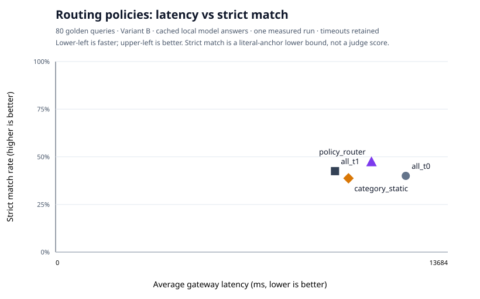

# Phase 12 routing frontier

Router manifest: `phase12_router_0d86de0d2bfc`
Golden set hash: `b59ee2659a17714c6cff995ef64a8da04cc7d601ca01ba1634d17e296dad551c`
Source model cells: `phase11_ollama_qwen3_4b_b_hybrid_61802221d874`, `phase11_ollama_qwen3_8b_b_hybrid_33c0a0d50c76`

Routing accuracy: **100.0%** over **80** labelled queries.
Source generation coverage: **T0 98.8% / T1 98.8%**. Failed source rows score as misses and retain their timeout wall latency.

| Policy | Strict match | Citation hit | Abstention accuracy | Avg gateway latency | P50 gateway latency | Escalation rate | Escalation efficacy |
|---|---:|---:|---:|---:|---:|---:|---:|
| `all_t0` | 40.0% | 56.2% | 57.5% | 12218 ms | 8613 ms | 0.0% | 0.0% |
| `all_t1` | 42.5% | 73.8% | 78.8% | 9749 ms | 6714 ms | 0.0% | 0.0% |
| `category_static` | 38.8% | 67.5% | 68.8% | 10219 ms | 7288 ms | 0.0% | 0.0% |
| `policy_router` | 47.5% | 75.0% | 78.8% | 11021 ms | 8082 ms | 12.5% | 70.0% |

Strict match is the conservative Phase-11 literal-anchor scorer, not an LLM-judge verdict. Dynamic-policy latency sums every attempted model call. The four policies reuse the exact same cached answers, so policy differences are routing effects rather than generation rerolls.

Latency is noisy: Phase 11 observed about 10% p95 movement between identical runs. Treat close x-axis positions as unresolved until Phase 18 repeats cells and reports a spread. Local cost remains $0.0 (unpriced, not free).

This report and its SVG are generated from the router RunManifest; per-query RoutingDecisions and source-cell ids live in the adjacent details receipt.
